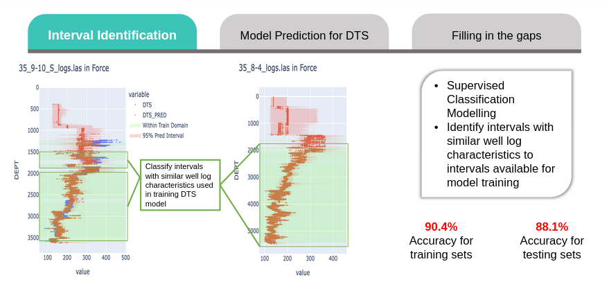

# Geohackathon 2022, All is Wells

## Problem
Well logs are valuable but often are missing or not entirely available. Hence, we attempt to infer these logs by using machine learning models.

## Solution
1. A classification model to identify if well logs are similar to the training data of the regression model.

2. A regression model to predict shear sonic logs using other common well logs.

3. Imputer models for general purpose imputation of the shear sonic logs as well as other well logs. 

